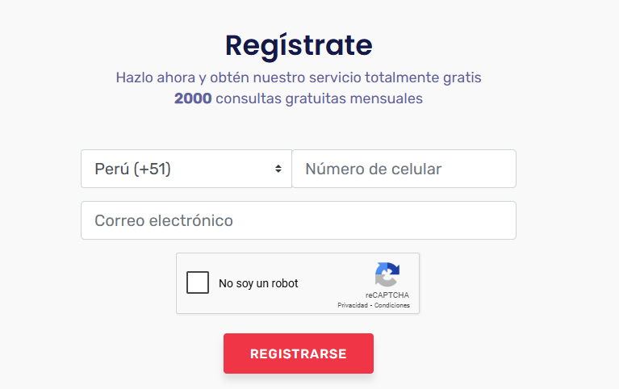
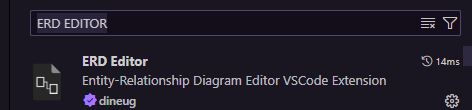
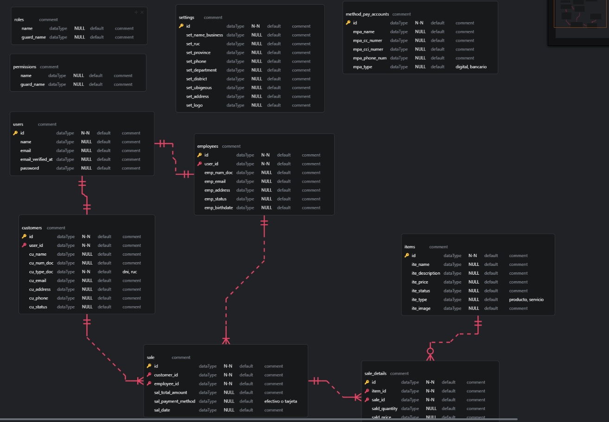
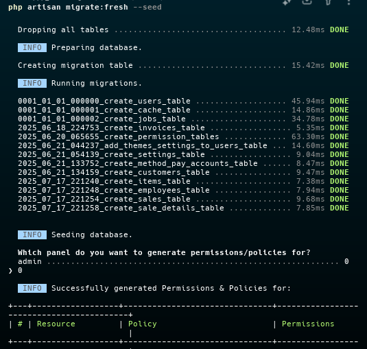

## Requerimientos
Tener instalado:
Laravel 12
Php +8.3 => verifica con php -v
Composer 2.8.8 => verifica con composer --version
Node v. 22 => verifica con node -v
Npm v 10.9.2 => verifica con npm -v

## Instalacion
- Paquetes y librerias:
``` bash 
  composer install; npm install; npm run build
```

- Crear tu archivo .env y copia todo de .env.example, o simplemente ejecuta en terminal:
``` bash 
  cp .env.example .env
```

## Setup base de datos 
### MySQL
configurar las credenciales de tu archivo **.env**
``` bash
  DB_CONNECTION=mysql
  DB_HOST=127.0.0.1
  DB_PORT=3306
  DB_DATABASE=laravel
  DB_USERNAME=root
  DB_PASSWORD=
```

### Sqlite
Puedes ejecutar en terminal despues de instalar php:
``` bash 
  php --ini
```
ingresar a tu php.ini, busca la extension "pdo_sqlite", elimina el " ; ", y guarda los cambios:
``` bash 
  extension=pdo_sqlite
```

### Obtener token de apis peru para busqueda por dni y ruc
1. Ir a esta pagina https://apisperu.com/servicios/dniruc y registrate

2. Te llegara a tu correo un token como este:
 **eyJ0eXAiOiJKV1QiLCJhbGciOiJIUzI1NiJ9....**
 copia y reemplaza el valor de la variable por VITE_TOKEN_DNI_API= de tu archivo **.env**
``` bash 
  VITE_TOKEN_DNI_API=eyJ0eXAiOiJKV1QiLCJhbGciOiJIUzI1NiJ9...
```

## Pasos para visualizar tu base de datos
1. Instalar la extension ERD EDITOR 

2. Abre el archivo db_tiburon.erd.json y veras tus tablas y sus datos:


## Ejecutar aplicacion
1. Ejecutar estos comando para publicar archivos javacript de livewire: 
``` sh
  php artisan livewire:publish --config 
  php artisan livewire:publish --assets 
```

2. Ejecutar el comando para publicar el storage link public:
``` sh
  php artisan storage:link
```

3. Ejecutar las migraciones e ingresa la opcion 0:
- Por primera vez:
``` sh
  php artisan migrate --seed
```
- Cuando quieres hacer un refresh
``` sh
  php artisan migrate:fresh --seed
```


- Al correr las migraciones se crearan los siguiente usuarios para iniciar las pruebas:

**Cuenta super admin:**
  ``` sh
  email: admin@tiburon.com
  pass: admintiburon
  ```
**Cuenta empleado:**
  ``` sh
  email: empleado1@tiburon.com
  pass: empleado1
  ```
**Cuenta cliente:**
  ``` sh
  email: rosmel@tiburon.com
  pass: cliente1
  ```
4. Levanta el servidor con:
 ``` sh
  composer run dev
```

5. Ingresar a la url:
 ``` sh
  http://127.0.0.1:8000
```