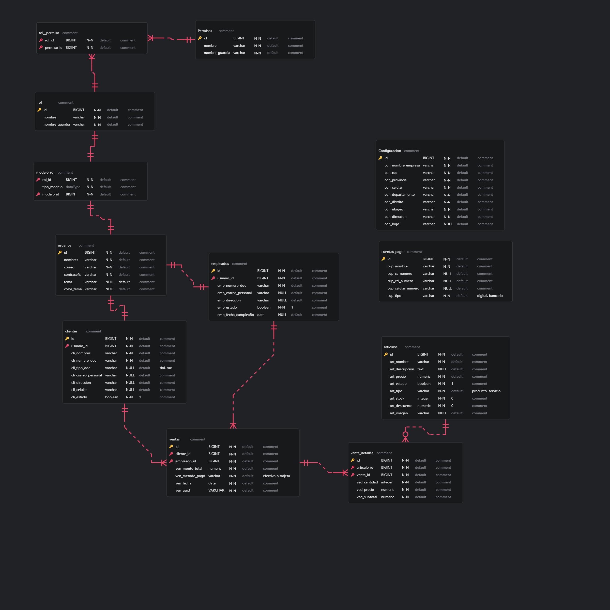

<details open>
  <summary>Tabla de contenido</summary>
  <ol>
    <li>
      <a href="#sobre-el-proyecto">Sobre el proyecto</a>
      <ul>
        <li><a href="#requerimientos">Requerimientos</a></li>
        <ul>
          <li><a href="#instaladores">Instaladores</a></li>
          <li><a href="#obtener-token-de-apis-peru-para-busqueda-por-dni-y-ruc">Obtener token de apis</a></li>
        </ul>
      </ul>
    </li>
    <li>
      <a href="#empezando">Empezando</a>
      <ul>
        <li><a href="#instalacion">Instalacion</a></li>
        <li><a href="#Configurar-base-de-datos">Configurar base de datos</a></li>
        <ul>
          <li><a href="#mysql">Mysql</a></li>
          <li><a href="#sqlite">Sqlite</a></li>
          <li><a href="#pasos-para-visualizar-tu-base-de-datos">Pasos para visualizar tu base de datos</a></li>
        </ul>
        <li><a href="#ejecutar-aplicacion">Ejecutar aplicacion</a></li>
      </ul>
    </li>
    <li>
      <a href="#recursos-para-informe-final">Recursos para informe final</a>
      <ul>
          <li><a href="#requerimientos-funcionales">Requerimientos funcionales</a></li>
          <li><a href="#stack-tecnológico-usadas-en-el-desarrollo">Stack Tecnológico usadas en el desarrollo</a></li>
          <li><a href="#futuras-mejoras">Futuras Mejoras</a></li>
          <li><a href="#screenshots">Screenshots</a></li>
          <li><a href="#manual-tecnico">Manual tecnico</a></li>
          <li><a href="#manual-de-usuario">Manual de usuario</a></li>
          <li><a href="#cronograma-de-actividades">Cronograma de actividades</a></li>
      </ul>
    </li>
  </ol>
</details>

## Sobre el proyecto
### Requerimientos
#### Instaladores:
- Laravel 12
- Php >= 8.3 => verifica con php -v
- Composer >= 2.8.8 => verifica con composer --version
- Node >= v. 22 => verifica con node -v
- Npm >= v. 10.9.2 => verifica con npm -v
- Git
- Cuenta de github XD

## Empezando
### Instalacion
- Clonar proyecto:
``` bash 
  git clone https://github.com/kev1n01/ppp_linder.git
  cd ppp_linder
```

- Paquetes y librerias:
``` bash 
  composer install; npm install; npm run build
```

- Crear tu archivo .env y copia todo de .env.example, o simplemente ejecuta en terminal:
``` bash 
  cp .env.example .env
```

#### Obtener token de apis peru para busqueda por dni y ruc
1. Ir a esta pagina https://apisperu.com/servicios/dniruc y registrate

2. Te llegara a tu correo un token como este:
 **eyJ0eXAiOiJKV1QiLCJhbGciOiJIUzI1NiJ9....**
 copia y reemplaza el valor de la variable por VITE_TOKEN_DNI_API= de tu archivo **.env**
``` bash 
  VITE_TOKEN_DNI_API=eyJ0eXAiOiJKV1QiLCJhbGciOiJIUzI1NiJ9...
```

### Configurar base de datos 
#### MySQL
configurar las credenciales de tu archivo **.env**
``` bash
  DB_CONNECTION=mysql
  DB_HOST=127.0.0.1
  DB_PORT=3306
  DB_DATABASE=laravel
  DB_USERNAME=root
  DB_PASSWORD=
```

#### Sqlite
Puedes ejecutar en terminal despues de instalar php:
``` bash 
  php --ini
```
ingresar a tu php.ini, busca la extension "pdo_sqlite", elimina el " ; ", y guarda los cambios:
``` bash 
  extension=pdo_sqlite
```

#### Pasos para visualizar tu base de datos
1. Instalar la extension ERD EDITOR 


2. Abre el archivo db_tiburon_español.erd.json y veras tus tablas y sus datos:


### Ejecutar aplicacion
1. Ejecutar estos comando para publicar archivos javacript de livewire: 
``` sh
  php artisan livewire:publish --config 
  php artisan livewire:publish --assets 
```

2. Ejecutar el comando para publicar el storage link public:
``` sh
  php artisan storage:link
```

3. Ejecutar las migraciones e ingresa la opcion 0:
- Por primera vez:
``` sh
  php artisan migrate --seed
```
- Cuando quieres hacer un refresh
``` sh
  php artisan migrate:fresh --seed

  #Si hacer un refresh y tienes imagenes subidas de settings, items, etc ejecuta el sigueinte comando
  php artisan storage:clean-public #Limpiara los archivos de tu storage/public
```


Al correr las migraciones se crearan los siguiente usuarios para iniciar las pruebas:
**Cuenta super admin:**
  ``` sh
  email: admin@tiburon.com
  pass: admintiburon
  ```
**Cuenta empleado:**
  ``` sh
  email: empleado1@tiburon.com
  pass: empleado1
  ```
**Cuenta cliente:**
  ``` sh
  email: rosmel@tiburon.com
  pass: cliente1
  ```
4. Levanta el servidor con:
 ``` sh
  composer run dev
```

5. Ingresar a la url:
 ``` sh
  http://127.0.0.1:8000
```

## Recursos para informe final
En la carpeta llamado **/recursos** dejo todo lo necesario imagenes pdf, .sql


### Requerimientos funcionales
  Este sistema ha sido desarrollado con enfoque en la gestión integral de un grifo, atendiendo a roles específicos (administrador, empleado y cliente), con las siguientes funcionalidades clave:
  
  **1. Autenticación y control de acceso por roles**
  - Implementación de control de acceso basado en roles: admin, empleado y cliente.
  - Cada rol tiene permisos y vistas asignadas según sus responsabilidades.
  
  **2. Landing Page informativa**
  - Página de inicio pública con diseño atractivo.
  - Muestra de productos y servicios destacados con descuentos.
  - Sistema de filtros por tipo (producto o servicio) y por nombre.
  - Acceso directo al login y otros módulos internos para un cliente.
  
  **3. Integración con API de terceros (APIs Perú)**
  - Consulta automática de nombres completos y razón social a través de DNI y RUC para agilizar el registro de nuevos clientes y empleados.
  
  **4. Perfil del usuario**
  - Panel de edición de perfil para empleado y admin con opción de actualización de nombre, correo y contraseña.

  **5. Personalización visual**
  - Soporte para modo claro y oscuro.
  - Posibilidad de modificar colores del panel y branding.
  
  **6. Dashboard administrativo (solo admin)**
  - Estadísticas en tiempo real:
    - Cantidad de ventas.
    - Productos bajo stock.
    - Producto y servicio más vendidos.
  - Gráficos de línea y barra para visualización de ventas por día o por tipo.

  **7. Módulos por rol**
  - **🔐 Rol administrador**
    - Gestión de clientes: CRUD completo.
    - Gestión de empleados: CRUD completo.
    - Gestión de ítems: Productos y servicios. CRUD completo.
    - Gestión de ventas: Ver todas las ventas, editar y descargar detalles.
    - Configuración de empresa: RUC, dirección, logo, teléfono, etc.
    - Cuentas de pago: Configura formas de pago digitales y bancarias, solo informativo.
    - Gestión de usuarios: CRUD completo.
    - Roles y permisos: CRUD completo.
  - **👷‍♂️ Rol empleado**
    - Clientes: Puede ver, crear y editar según permisos asignados.
    - Ítems: Puede ver productos y servicios disponibles.
    - Ventas: Crear nuevas ventas, ver sus propias ventas, generar y descargar PDFs con mas detalles.
  - **👤 Rol cliente**
    - Mis compras: Lista detallada de sus compras, con opción de ver y descargar el detalle en PDF.
    - Lista de ítems: Visualización personalizada de productos y servicios con filtros sin regresar a la landing.

### Stack Tecnológico usadas en el desarrollo
| Herramienta          | Función                                                |
| -------------------- | ------------------------------------------------------ |
| **Laravel 12**       | Framework backend y frontend principal                 |
| **MySQL**            | Sistema de gestión de base de datos                    |
| **Tailwind CSS v3**  | Framework de estilos CSS para diseño moderno           |
| **Laravel Filament** | Sistema de paneles administrativos personalizados      |
| **Inertia.js**       | Comunicación fluida entre Laravel y VueJS              |
| **Vue 3**            | Framework frontend utilizado para construir la landing |
| **APIs Perú**        | API externa para validar datos por RUC o DNI           |


### Futuras Mejoras
  - 🔔 Envío de correos promocionales a clientes sobre nuevos descuentos u ofertas especiales.
  - 💬 Integración con WhatsApp para atención al cliente directa y automatizada.
  - 🛒 Módulo de compras: control de proveedores y compras de productos.
  - 📊 Reportes financieros: informes detallados de ingresos, egresos, rentabilidad mensual y anual.
  - 🧾 Facturación electrónica y boletas de venta.
  - 📦 Control de stock avanzado: alertas por niveles mínimos y máximos de productos.

### Screenshots
1. Landing page vista publica 

- Productos y servicios vista publica

2. Autenticacion
- Login para admin y empleados

-Login para clientes

3. Perfil de usuario

4. Integracion de API por dni y ruc

5. Personalizacion visual

6. Dashboard administrativo solo admin

7. Modulo clientes admin

8. Modulo empleado admin

9. Modulo items admin

10. Modulo ventas admin

11. Modulo usuarios admin

12. Modulo roles y permisos

13. Modulo configurar empresa admin

14. Modulo ventas empleado


15. Modulo cliente empleado

16. Modulo mis compras cliente

17. Modulo lista de items cliente

10. Rendimiento de la pagina web


### Manual tecnico

### Manual de usuario

### Cronograma de actividades

| Fase                        | Actividad / Subactividad                                   | Duración estimada | Mes     | 
| --------------------------- | ---------------------------------------------------------- | ----------------- | ------- | 
| Análisis y planificación | Recolección de requerimientos funcionales y no funcionales | 1 semana          | Mes 1   | 
|                             | Definición de roles y permisos                             | 2 días            | Mes 1   |
|                             | Priorización de módulos principales                        | 3 días            | Mes 1   |
|                             | Diseño del roadmap del producto                            | 2 días            | Mes 1   |
| Diseño del sistema       | Diseño de arquitectura general del sistema (MVC, DB)       | 1 semana          | Mes 1   | 
|                             | Diseño de base de datos (modelos, relaciones)              | 4 días            | Mes 1   |
|                             | Mockups de interfaz (landing + paneles)                    | 1 semana          | Mes 1   |
| Desarrollo backend      | Configuración del entorno (Laravel, Filament, Inertia)     | 2 días            | Mes 2   | 
|                             | Módulo de autenticación con roles                          | 3 días            | Mes 2   |
|                             | Creacion de migraciones y modelos                           | 1 semana          | Mes 2   |
|                             | API Perú: Integración para DNI/RUC                         | 3 días            | Mes 2   | 
| Desarrollo frontend      | Maquetación de landing page con Vue + Tailwind             | 1 semana          | Mes 2   | 
|                             | Navbar, Hero, Productos destacados, Footer                 | 1 semana          | Mes 2-3 |
|                             | Página de items y servicios (con filtros, cards, buscador) | 1 semana          | Mes 3   |
| Desarrollo panel admin   | Módulo de Items (CRUD + filtros + descuentos + stock)      | 1 semana          | Mes 3   | 
|                             | Módulo de Ventas (repeater + PDF + stock dinámico)         | 1 semana          | Mes 3   |
|                             | Módulo de Clientes y Empleados                             | 1 semana          | Mes 3   |
|                             | Módulo de Configuración general                            | 4 días            | Mes 3   |
| Estadísticas y gráficos  | Dashboard con widgets de estadísticas (ventas, items)      | 1 semana          | Mes 4   | 
|                             | Gráfico de línea y barra por tipo y por día                | 4 días            | Mes 4   |
|                             | Widgets de top productos, servicios, bajo stock            | 3 días            | Mes 4   |
| Pruebas                  | Pruebas funcionales de cada módulo                         | 1 semana          | Mes 4   | 
|                             | Pruebas de roles y accesos                                 | 3 días            | Mes 4   | 
|                             | Validaciones de formularios y errores                      | 3 días            | Mes 4   | 
| Lanzamiento inicial      | Despliegue en servidor de staging                          | 2 días            | Mes 5   | 
|                             | Corrección de errores post QA                              | 3 días            | Mes 5   |
|                             | Revisión con cliente / revisión final                      | 2 días            | Mes 5   |
|                             | Despliegue a producción                                   | 2 días            | Mes 5   |
| Documentación final      | Manual técnico y de usuario                                | 1 semana          | Mes 5   | 
